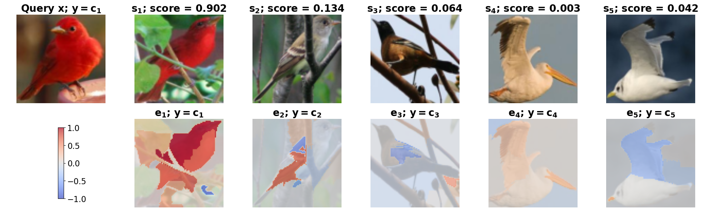

# RENEX: Relation Network Explainer for Few‑Shot Learning


RENEX explanation for a 5‑way 1‑shot classification task on the `Caltech-UCSD Birds 200` dataset. **Top row:** the query image $x$ (far left) followed by support samples $s_1$ – $s_5$ (left to right), with each pair’s RN relation score displayed above. **Bottom row:** corresponding explanation heatmaps $e_1$ – $e_5$, where red indicates positive contributions, blue negative, and gray neutral. Class labels $c_1$ – $c_5$ are Summer Tanager, Field Sparrow, Orchard Oriole, White Pelican, and Red‑legged Kittiwake, respectively.

## 🔍 Introduction

RENEX (RElation Network EXplainer) is a local, post‑hoc explainer designed to shed light on the decision‑making process of Relation Networks in n‑way 1‑shot few‑shot learning. By systematically perturbing superpixel regions of each support image and measuring changes in the network’s relation score, RENEX produces fine‑grained heatmaps that highlight positive (red) and negative (blue) contributions to a given prediction. RENEX works out‑of‑the‑box on both RGB (miniImageNet, CIFAR100, CUB‑200‑2011) and grayscale (Omniglot) benchmarks, and is fast enough for real‑time deployment.

## 🚀 Features

- **Model‑agnostic**: Works with any pretrained Relation Network (RN) architecture.  
- **Fast**: Generates explanations in ≈0.05–0.07 s per support/query pair.  
- **Accurate**: Outperforms LIME and Integrated Gradients on insertion/deletion metrics.  
- **RGB & Grayscale**: Easily switch between color datasets (`rgb`) and black‑&‑white (`bw`).  

## 📥 Data Preparation

1. **miniImageNet**  
   - Download the Ravi & Larochelle split from  
     `https://yaoyaoliu.web.illinois.edu/projects/mtl/download/Lmzjm9tX.html`  
   - Unzip into `data/Imagenet/`. No further preprocessing required.

2. **CIFAR‑100**  
   - Download from the same link as miniImageNet (split available).  
   - Place under `data/CIFAR100/`.  

3. **CUB‑200‑2011**  
   - Download images & annotations from  
     `https://www.vision.caltech.edu/datasets/cub_200_2011/`  
   - Unpack into `data/CUB100/` and run:
     ```bash
     python data/cub_processing.py
     ```

4. **Omniglot**  
   - Clone or download from `https://github.com/brendenlake/omniglot`.  
   - Merge `images_background/` and `images_evaluation/` into `data/Omniglot/`.  

## ⚙️ Configuration (`settings.py`)

Edit `settings.py` to switch datasets, adjust training/testing regimes, and tune hyperparameters.

## 💻 Code Base Usage

This codebase provides end-to-end training and evaluation of a Relation Network for an n‑way k‑shot task via the `main` script, through the `mode` parameter in the `settings.py` file.

## 📊 Result Reproduction
All quantitative and qualitative figures (AUC scores, heatmaps) from the paper can be regenerated by:
1. Ensuring your setting match those in the paper's Section V (segmenter, replacement colors, seeds);
2. Running both `experiments.py` and `experiments_gradients.py`;
3. Inspecting the output csv and saved heatmaps in `results/`.
